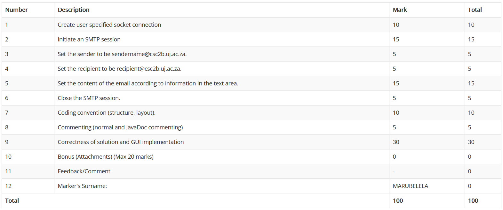

# SMTP Client 📨

## Table of Content

## Marks



## Introduction

For practical 1, we have to make a mail client that sends email. For this
practical, we use [JavaFX](https://openjfx.io/) to make a graphical user
interface.

## SMTP Server Setup

We still haven't learnt how to make a server in Java, that's why the lecturer
suggested using
[Papercut-SMTP](https://github.com/ChangemakerStudios/Papercut-SMTP). By using
this, we could test out whether our Java application is properly sending emails.

### Installation

Installing [Papercut-SMTP](https://github.com/ChangemakerStudios/Papercut-SMTP)
was super easy, I downloaded the Papercut.Smtp.Setup.exe
[here](https://github.com/ChangemakerStudios/Papercut-SMTP/releases).

### Connecting to Papercut

In order to connect to Papercut-SMTP, I had to understand 2 fundamental things:

- [Papercut-SMTP](https://github.com/ChangemakerStudios/Papercut-SMTP) runs on
  localhost
- [Papercut-SMTP](https://github.com/ChangemakerStudios/Papercut-SMTP)'s SMTP
  server runs on port 25 (default for any SMTP server).

By understanding these 2 things, we can connect to Papercut-SMTP like this
**(Papercut-SMTP has to be running)**:

```java
import java.net.*;

public class Main{
  public static void main(String[] args){
    Socket socket = new Socket("127.0.0.1", 25);
  }
}
```

## Structure of project

There were 2 main components to this practical:

- Graphical User Interface
- Mail sender functionality

Both fall under the same [package](./src/Mail). For this practical, I'll just focus on 
explaining the SMTP protocol and how we can connect to an SMTP server in java.

## Communicating with SMTP Server

### Automatic Resource Management

Before we start communicating with the server, I'd like to discuss Automatic
Resource Management. In order to communicate with the SMTP server, we need 3
basic things:

- [Socket](https://docs.oracle.com/javase/8/docs/api/java/net/Socket.html)
- [InputStream](https://docs.oracle.com/javase/8/docs/api/java/io/InputStream.html)
- [OutputStream](https://docs.oracle.com/javase/8/docs/api/java/io/OutputStream.html)

In the old version of java (I think before java 7), you'd have to use try catch
like this:

```java
import java.net.*;

public class Main{
    public static void main(String[] args){
      Socket socket = null;

      try{
        socket = new Socket("127.0.0.1", 25);

        //Use resources...
      }
      catch(Exception exc){
        exc.printStackTrace();
      }
      finally{
        if(socket !== null){
          socket.close();
        }
      }
    }
}
```

This is called the disposable pattern. But luckily for us, we can have something
a little more concise through the use of ARM:

```java
import java.net.*;
public class Main{
    public static void main(String[] args){

      try(Socket socket = new Socket("127.0.0.1", 25)){
        //Use resources...
      }
      catch(Exception exc){
        exc.printStackTrace();
      }
    }
}
```

This is valid, but you have to make sure the things you are passing into the try
arguments implement the
[closeable](https://docs.oracle.com/javase/8/docs/api/java/io/Closeable.html)
interface. The code snippet above was just an example of how to use ARM, which
will be used extensivley.

### Connecting to the SMTP Server

In order to connect to Papercut-SMTP, we have to use a
[Socket](https://docs.oracle.com/javase/8/docs/api/java/net/Socket.html)

```java
import java.io.*;
import java.net.*;

public class Main{
    public static void main(String[] args){
      try(Socket socket = new Socket("127.0.0.1", 25)){
        //Use resources...
      }
      catch(UnknownHostException exc){
          // Handle UnknownHostException
      }
      catch(IOException exc){
          // Handle IOException
      }
    }
}
```

This is enough to establish a connection to the SMTP Server.

### Communicating with the SMTP Server

In the [previous section](#connecting-to-the-smtp-server), we connected to the
SMTP server, now we want to communicate with the server. In order to communicate
with the server, we have to make use of
[InputStreams](https://docs.oracle.com/javase/8/docs/api/java/io/InputStream.html)
&
[OutputStreams](https://docs.oracle.com/javase%2F7%2Fdocs%2Fapi%2F%2F/java/io/OutputStream.html).
We have to use classes that inherit from these streams because they are abstract
classes.

We'll use the streams provided by the socket to communicate with the server. To
write messages to the server, we'll use the
[PrintWriter](https://docs.oracle.com/javase/8/docs/api/java/io/PrintWriter.html)
& to read responses from the server, we'll use
[InputStreamReader](https://docs.oracle.com/javase%2F7%2Fdocs%2Fapi%2F%2F/java/io/InputStreamReader.html)
&
[Scanner](https://docs.oracle.com/javase%2F7%2Fdocs%2Fapi%2F%2F/java/util/Scanner.html).

```java
import java.io.*;
import java.net.*;
import java.util.Scanner;

public class Main{
  public static void main(String[] args) {
        try(
                // Papercut SMTP running on port 25
                Socket SMTPSocket = new Socket(host, port);

                // Stream communication tools
                PrintWriter out = new PrintWriter(SMTPSocket.getOutputStream(), true);
                InputStreamReader inputStream = new InputStreamReader(
                        new BufferedInputStream(SMTPSocket.getInputStream()),
                        "UTF-8"
                );
        ){
          Scanner in = new Scanner(inputStream);

          // Confirming connection to the SMTP server
          System.out.println(in.nextLine());
        }
        catch(UnknownHostException exc){
          // Handle UnknownHostException
        }
        catch(IOException exc){
            // Handle IOException
        }
  }
}
```

#### Sending messages to the server

```java
public class Main{
    public static void oldCode() {
        try(
        // Papercut SMTP running on port 25
        Socket SMTPSocket = new Socket("127.0.0.1", 25);

        // Stream communication tools
        PrintWriter out = new PrintWriter(SMTPSocket.getOutputStream(), true);
        InputStreamReader inputStream = new InputStreamReader(new BufferedInputStream(SMTPSocket.getInputStream()), "UTF-8");
        ){
        Scanner in = new Scanner(inputStream);
        // Confirming connection to the SMTP server
        System.out.println(in.nextLine());

        // Sending connection request
        write(out, "HELO relay.example.org");
        System.out.println(in.nextLine());

        // Setting sender email
        write(out, "MAIL FROM:<bob@example.org>");
        System.out.println(in.nextLine());

        // Setting recipient
        write(out, "RCPT TO:<alice@example.com>");
        System.out.println(in.nextLine());

        write(out, "DATA");
        System.out.println(in.nextLine());

        write(out, """
                    From: "Bob Example" <bob@example.org>
                    To: "Alice Example" <alice@example.com>
                    Cc: theboss@example.com
                    Date: Tue, 15 Jan 2008 16:02:43 -0500
                    Subject: Test message
                    
                    This is my email
                    \r\n.\r\n""");
        System.out.println(in.nextLine());
        }catch(UnknownHostException exc){
        System.out.println("Unknown Host");
        }catch(IOException exc){
        System.out.println("IO Exception");
        }
        }
}
```